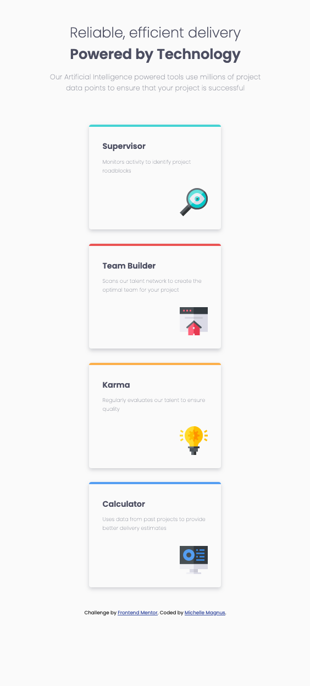
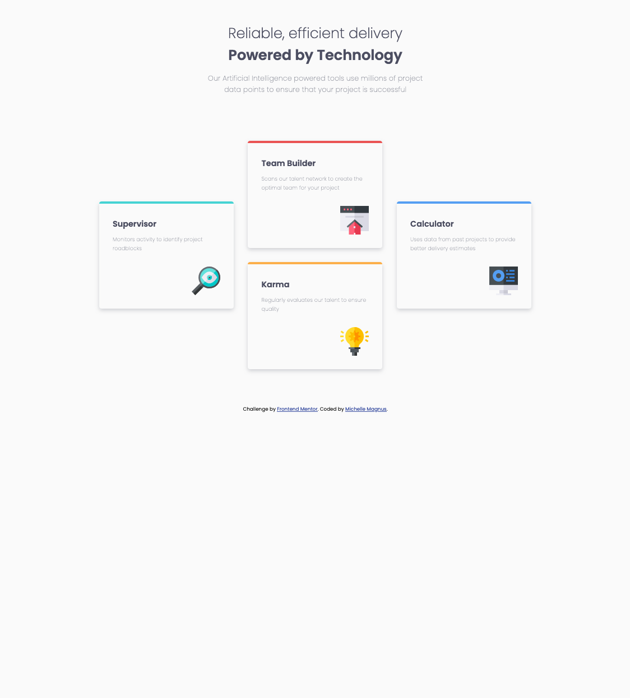

# Frontend Mentor - Four card feature section solution

This is a solution to the [Four card feature section challenge on Frontend Mentor](https://www.frontendmentor.io/challenges/four-card-feature-section-weK1eFYK). Frontend Mentor challenges help me improve my coding skills by building realistic projects. 

## Table of contents

- [Overview](#overview)
  - [The challenge](#the-challenge)
  - [Screenshot](#screenshot)
  - [Links](#links)
- [My process](#my-process)
  - [Built with](#built-with)
  - [What I learned](#what-i-learned)
  - [Continued development](#continued-development)
  - [Useful resources](#useful-resources)
- [Author](#author)
- [Acknowledgments](#acknowledgments)

**Note: Delete this note and update the table of contents based on what sections you keep.**

## Overview

### The challenge

Users should be able to:

- View the optimal layout for the site depending on their device's screen size

### Screenshot

I have no idea why my cards appear to be different sizes.  Would love feedback as to how to resolve this issue.

### Links

- My Solution in GitHub: [https://github.com/Magnus602/Four-Card-Feature-Section.git]
- Link to Frontend Mentor Project: [https://www.frontendmentor.io/challenges/four-card-feature-section-weK1eFYK]

## My process

I started out looking at the solution picture in desktop view and then in mobile view.  There appeared to be a HEADER with two titles and a paragraph.  There also appeared to be three columns with one card sitting in one column, two in the center, and one in the third, so I structured the next section with a DIV tag with a class of "cards" to cover all of cards in the body.  From there, each card needed to be sectioned into columns, and then determine what the composition is of each card.  It has a heading/title, paragraph, and img/icon...

I began designing the Mobile-first workflow using a display: flex, direction: column.  Then I designed for desktop using the media query in CSS.  The immediate "fix" is to change the direction from column to row and then the spacing margins of a couple of the cards.

Once I aligned the footer text to center, and discovered that my cards did not appear to be centered.  I used padding-left by a whopping 4rem to get it centered.  There has to be a way that makes more sense than eye-balling the spacing.  

The issue I have come across is that my first card (Supervisor) appears to be smaller than every other card.  The Team Builder card is the largest.  Not sure how this happened or how to fix it.

***UPDATE***: I ended up changing the max-width to 300px and added a max-height of 275px.  I was so excited that it worked everything out.  I also no longer needed the 4rem padding, so deleted it.  Whew!  Love these little wins.

I am a HUGE proponent of best practices.  I am ALWAYS learning and want to keep my code DRY and readable.  I would LOVE to read your feedback or if you have videos, articles, etc. that you want to share, I'm grateful.

### Built with

- Semantic HTML5 markup
- CSS custom properties
- Flexbox
- CSS Flexbox 
- Mobile-first workflow
- [Google Fonts](https://fonts.google.com/specimen/Poppins) - For fonts

### What I learned

1. No matter how many times I review my code, sometimes the solution or fix cannot be discovered, so...  
2. Collaborative learning and/or code reviews are helpful to find different or more effective solutions.
3. Watching how other people code can help you code better (or know what you don't want to do).
4. I'm not a huge fan of the bootstrap layout, so I didn't use it this time.
5. Filling out the ReadMe file seems to take the longest. LOL

### Continued development

I'm a huge fan of Kevin Powell, so I'm always watching his videos on how to make my CSS better.

There are many sites including W3schools I use when I have questions.

I watch how other people solution their projects, AFTER I create my own.  In the past, I have found that their solutions don't make sense to me or they don't work for me.  I may mirror their layout because it's very readable, but everything else I need to do on my own.  By doing this, my code has improved.  

## Author

- GitHub - [Magnus602](https://github.com/Magnus602)
- Frontend Mentor - [@Magnus602](hhttps://www.frontendmentor.io/profile/Magnus602)

## Acknowledgments

I'll always give a shout out to Kevin Powell, my CSS hero.  Sadly, he did not do this challenge.